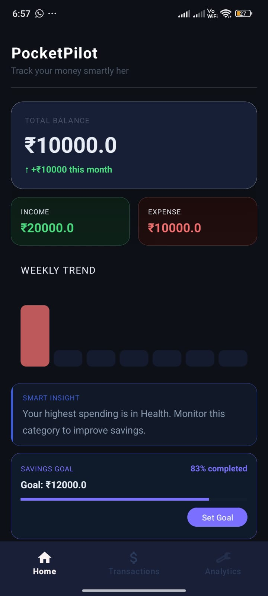
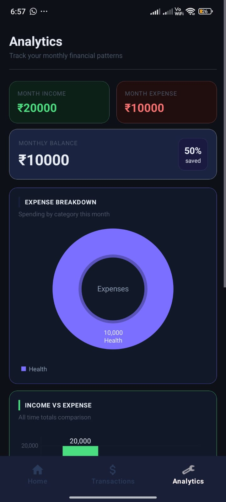
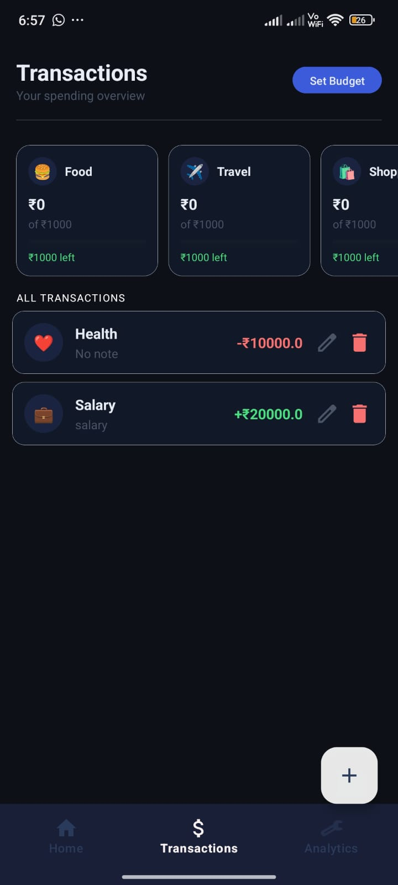
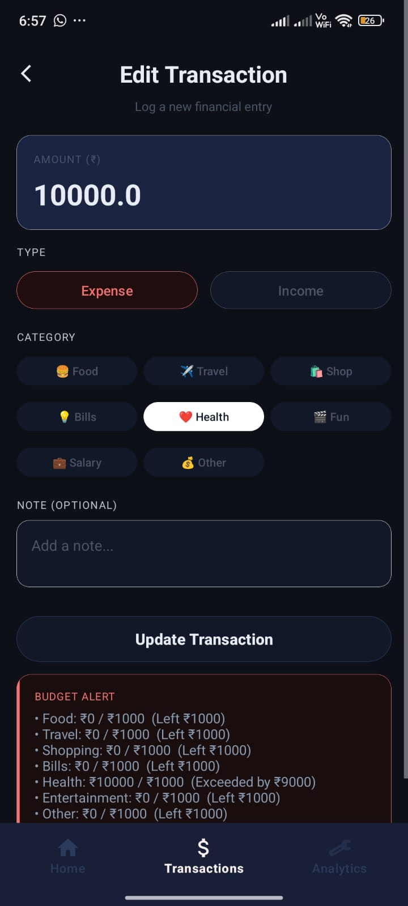
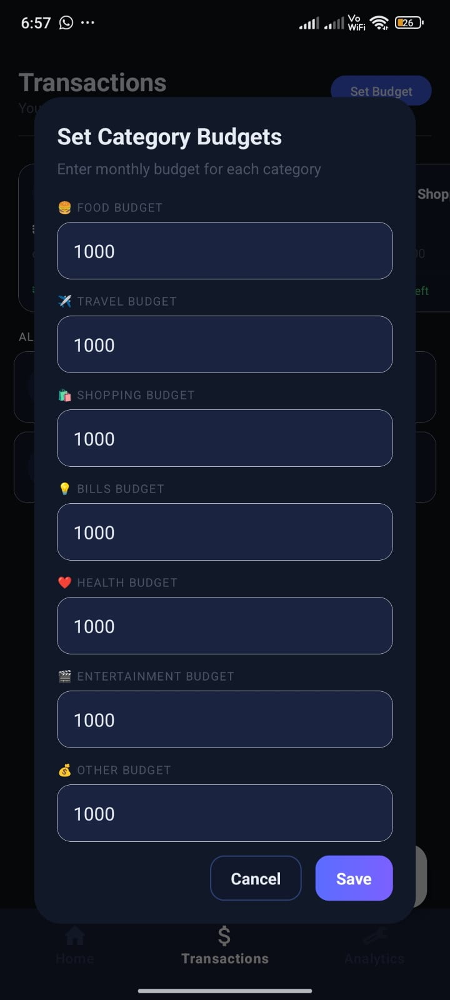

# 🚀 PocketPilot – Smart Personal Finance Tracker

> Track. Analyze. Optimize. 💰  
PocketPilot is a modern Android application designed to help users manage their finances efficiently with real-time insights, budget tracking, and beautiful analytics.

> 📌 This project is developed as part of the screening assessment for the **Mobile App Developer Intern** position at **Zorvyn**.

---

## 📱 App Preview

### 🏠 Home Screen
- Overview of balance, income, expenses
- Weekly trend visualization
- Smart insights & savings goal tracking

### 📊 Analytics Screen
- Expense breakdown (Donut Chart)
- Income vs Expense comparison
- Weekly comparison insights

### 💳 Transactions Screen
- Add / Edit / Delete transactions
- Category-based tracking
- Budget monitoring

---

## 🖼️ Screenshots

| Home | Analytics | Transactions |
|------|----------|-------------|
|  |  |  |

| Edit Transaction | Budget Dialog |
|-----------------|--------------|
|  |  |

---

## ✨ Features

### 💰 Financial Tracking
- Add, update, delete transactions
- Categorize expenses (Food, Travel, Health, etc.)
- Income & Expense tracking

### 📊 Smart Analytics
- Income vs Expense bar graph
- Expense breakdown using donut chart
- Weekly comparison (This Week vs Last Week)

### 🎯 Budget Management
- Set category-wise monthly budgets
- Real-time budget alerts
- Shows exceeded or remaining budget

### 🧠 Smart Insights
- Highlights highest spending category
- Suggests improvements for better savings

### 📈 Goal Tracking
- Set savings goals
- Progress tracking with percentage completion

---

## 🏗️ Architecture

The app follows **MVVM (Model-View-ViewModel)** architecture for clean separation of concerns.

###  Project Structure

```text
com.example.pocketpilot
│
├── data
│   ├── local (Room Database)
│   │   ├── AppDatabase
│   │   ├── TransactionDao
│   │   └── TransactionEntity
│   ├── repository
│   │   └── FinanceRepository
│
├── ui
│   ├── home
│   ├── analytics
│   ├── transactions
│   └── viewmodel
│
└── MainActivity
```

---

## 🧱 Tech Stack

- **Language:** Kotlin  
- **Architecture:** MVVM  
- **Database:** Room Database (SQLite)  
- **UI:** XML (Material Design)  
- **State Management:** ViewModel + LiveData  
- **Navigation:** Navigation Component  
- **Storage:** SharedPreferences (for goals & budgets)  

---

## ⚙️ How It Works

### 📌 Data Flow

UI → ViewModel → Repository → Room Database

### 📌 Example

- User adds transaction  
- Stored in Room DB  
- ViewModel updates LiveData  
- UI auto-refreshes  

---

## 🚀 Installation

1. Clone the repository:

```bash
git clone https://github.com/RatnaSrivastava16/PocketPilot.git
```
2. Open in Android Studio

3. Build & Run 🚀

---

## 📌 Key Highlights
- 🔥 Clean and scalable architecture
- 🎨 Modern UI with dark theme
- ⚡ Real-time updates using LiveData
- 📊 Data-driven insights
- 📱 Fully responsive layouts

---

## 🧪 Future Improvements
- 🔐 User Authentication (Firebase)
- ☁️ Cloud Sync
- 📉 Advanced charts (MPAndroidChart)
- 🤖 AI-based spending predictions
- 📤 Export reports (PDF/CSV)
